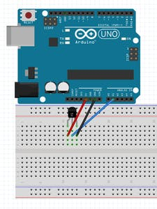
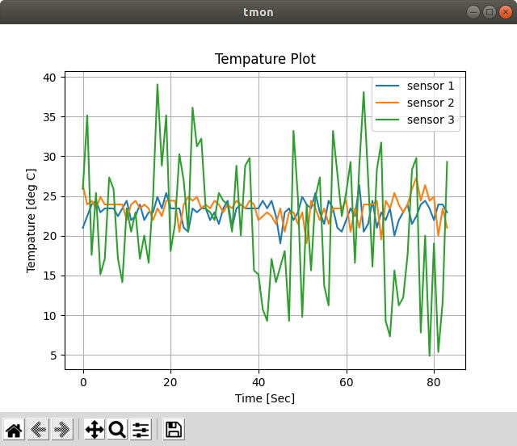

# tmon-cli 

A Command Line Utility for Temperature measurement using LM35 and Arduino


## Pin Connections to Arduino

- A1 <- sensor 1
- A2 <- sensor 2
- A3 <- sensor 3

<p align="center">
  
</p>

## Installation

```bash
# clone the repository
$ git clone git@github.com:filsgrp/tmon-cli.git

# move into tmon-cli folder
$ cd tmon-cli

# install requirements
$ pip install -r requirments.txt

# intall tmon
$ pip install .

# check installation
$ tmon
Usage: tmon [OPTIONS] COMMAND [ARGS]...

  tmon - Temperature Mointor Utitlity for capturing data from 3 LM35
  Temperature sensors through Arduino.

Options:
  --help  Show this message and exit.

Commands:
  run   collect the serial data from Arduino
  view  view previously collected data FILE - specify the .csv file
        location...

# change the required number of trials in the timon.ino and dump the file into the development board 
$ head tmon-cli/arduino/tmon/tmon.ino 

int i = 0;
int trials = 100;

// connect sensor 1 to Analog pin A1
int sensor1= A1;
// connect sensor 2 to Analog pin A2
int sensor2= A2;
// connect sensor 3 to Analog pin A3
int sensor3= A3;


```

### Usage

- tmon commands
    ```bash
    $ tmon 
    Usage: tmon [OPTIONS] COMMAND [ARGS]...
    
      tmon - Temperature Mointor Utitlity for capturing data from 3 LM35
      Temperature sensors through Arduino.
    
    Options:
      --help  Show this message and exit.
    
    Commands:
      run   collect the serial data from Arduino
      view  view previously collected data FILE - specify the .csv file
            location...
    ```
- run sub command
    ```bash
    $ tmon run --help
    Usage: tmon run [OPTIONS]
    
      collect the serial data from Arduino
    
    Options:
      -p, --path TEXT    path for output csv file to be created
      -o, --output TEXT  name of the output csv file to be created
      -s, --show         show captured data as a plot at the end
      --help             Show this message and exit.
    ```

- view subcommand
    ```bash
    $ tmon view --help
    Usage: tmon view [OPTIONS] FILE
    
      view previously collected data
    
      FILE - specify the .csv file location that you want to view
    
    Options:
      --help  Show this message and exit.
    ```

### Examples

- Run Command
    ```bash
    # when arudino connetion is not available, tmon exists with the following message    
    $ tmon run
    Arduino Connection Not Found, Check the USB Connection..!!
    
    # when arduino is connected, tmon starts collecting serial data
    $ tmon run
    listening for serial data....
    26.37 26.37 26.37
    26.37 26.37 26.86
    26.86 26.37 26.86
    26.37 26.37 26.86
    .................
    .................
    26.37 26.86 26.86
    26.37 26.37 26.86
    finished
    Connection Closed
    saving data into csv file
    data saved to : ./temperature-20201203-160507.csv
    ```

- View Command
    ```bash
    $ tmon view data/temperature-20201202-155207.csv
    ```

<p align="center">
  
</p>


### Credits
- [create.arduino.cc](https://create.arduino.cc/projecthub/infoelectorials/project-003-arduino-lm35-temperature-sensor-project-0a43ba)